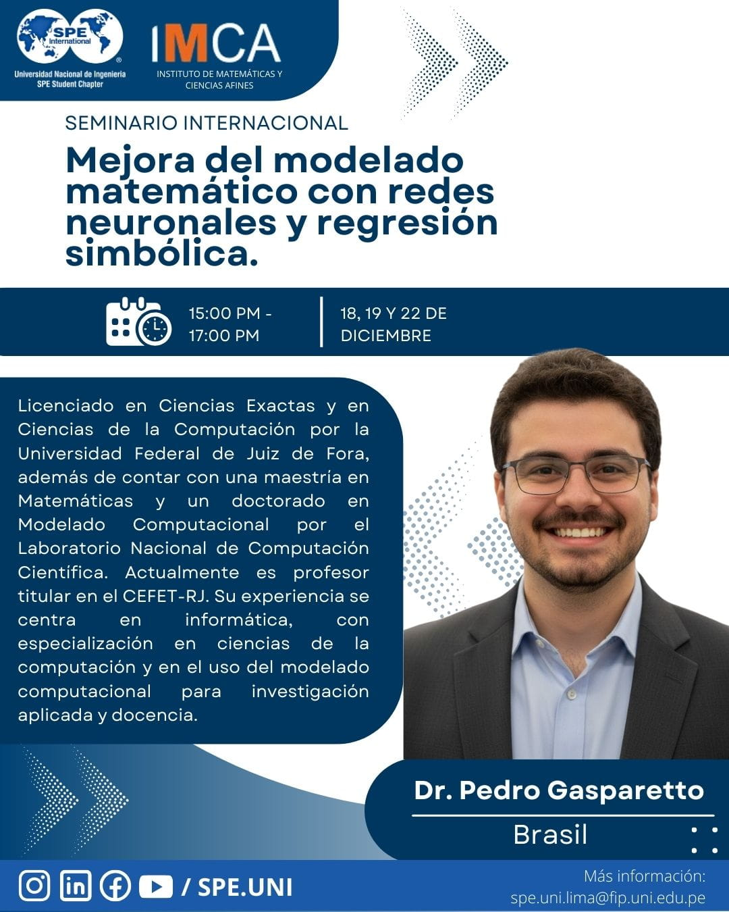

# Mejora del modelado matemático con redes neuronales y regresión simbólica

[Prof. Pedro Henrique Gasparetto Lugão](https://www2.ufjf.br/noticias/2020/03/12/pesquisa-estuda-dinamica-populacional-do-aedes-aegypti-por-meio-de-equacoes-matematicas)

- [Clase 1]()
- [Clase 2]()
- [Clase 3]()

```console
$ yay -S 
```

